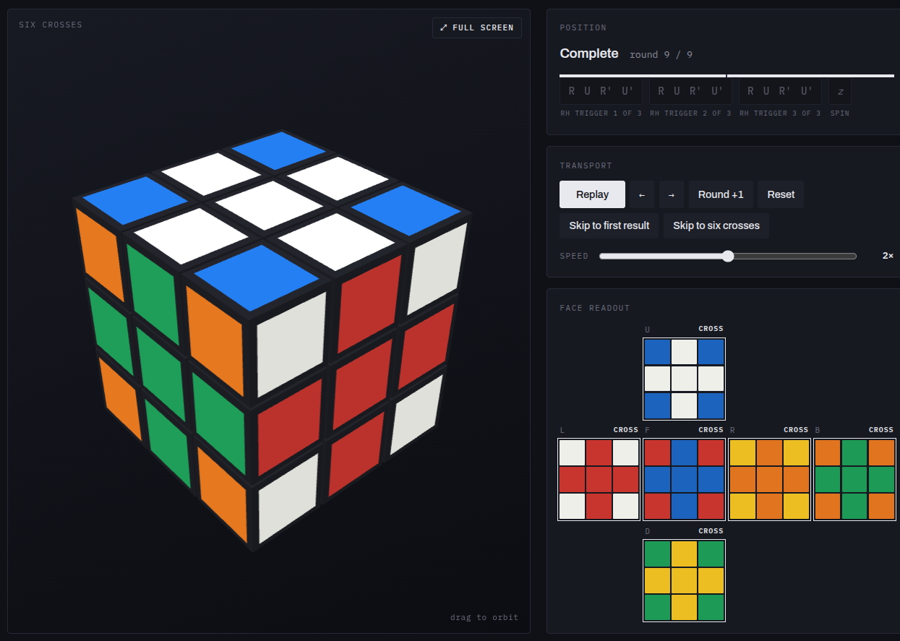

# Every Face a Cross

An interactive walkthrough of a Rubik's Cube pattern that puts a cross on all six
faces using nothing but the Right-Hand Algorithm (`R U R' U'`).

[](https://mrkwllmsn.github.io/rubiks-crosses/)

**[Open the demo](https://mrkwllmsn.github.io/rubiks-crosses/)** — a 3D viewer that
plays the sequence move by move, narrates each turn, and shows the state of all six
faces as it goes.

## The method

Pick a face to look at, your **anchor**. Run the Right-Hand Algorithm three times,
turn the whole cube a quarter turn clockwise while still watching the anchor, and
repeat. After exactly **9 rounds** the anchor comes back solid, along with the face
behind it, and the four faces ringing them are crosses.

Then change anchor: turn one of the cross faces to the front and run the same nine
rounds against it. All six faces end up with a cross.

```
((R U R' U')3 z)9  y  ((R U R' U')3 z)9
```

Grouped with parentheses rather than square brackets, since `[A, B]` is a
commutator in standard notation. Parses in alg.cubing.net, twizzle and cubing.js.

```
phase 1:   ((R U R' U')3 z)9    anchor + opposite solid, 4 crosses
re-anchor: y                    a cross face comes to the front
phase 2:   ((R U R' U')3 z)9    six crosses
```

216 face turns, 19 whole-cube rotations, one algorithm.

Nothing recognisable appears before round 9: no partial cross, no hint you are
close. That is why the pattern is easy to miss.

### Choosing the two colours

In phase one every face keeps its own colour as the background and takes as its
cross *the colour a single spin would bring onto it*. Spinning clockwise, that is
the face on its left. Put the background colour on top and the cross colour on its
left before you start. Only adjacent colours can pair, so opposite colours never
meet. Stop at the end of phase one if you want a specific pair; phase two
re-colours everything.

The verified move sequence and the colour rules above were both checked against a
cube simulator before the page was written.

Found by Mark Williamson.
